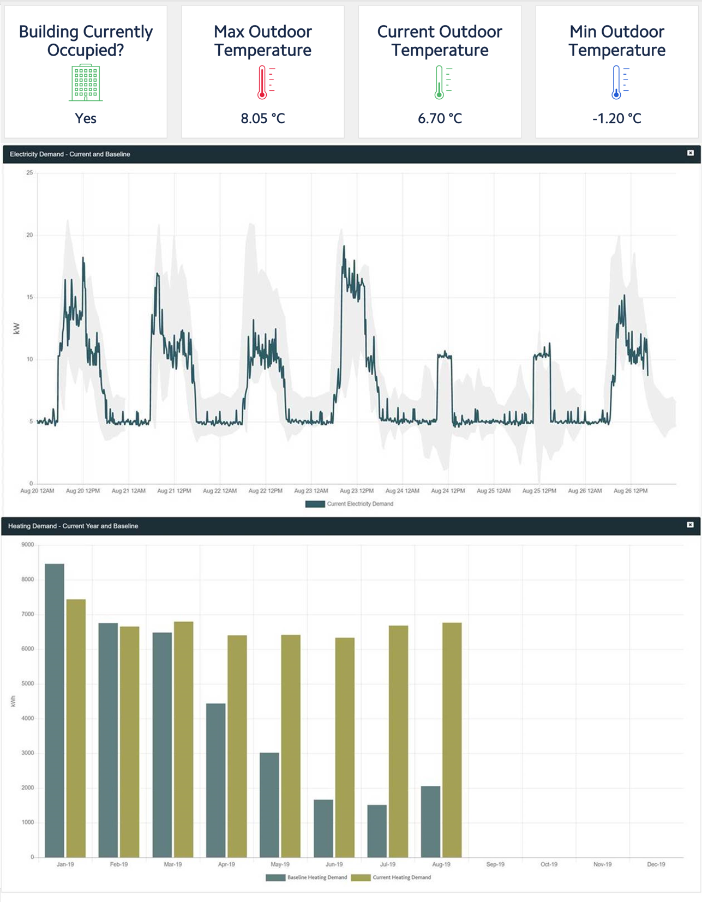
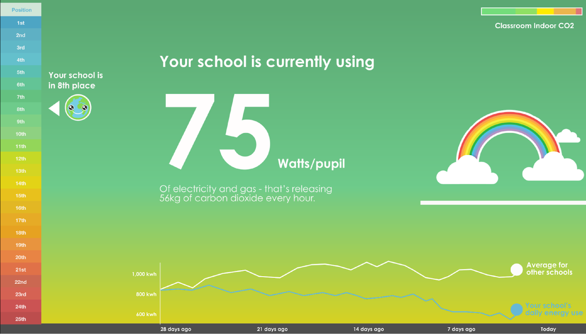
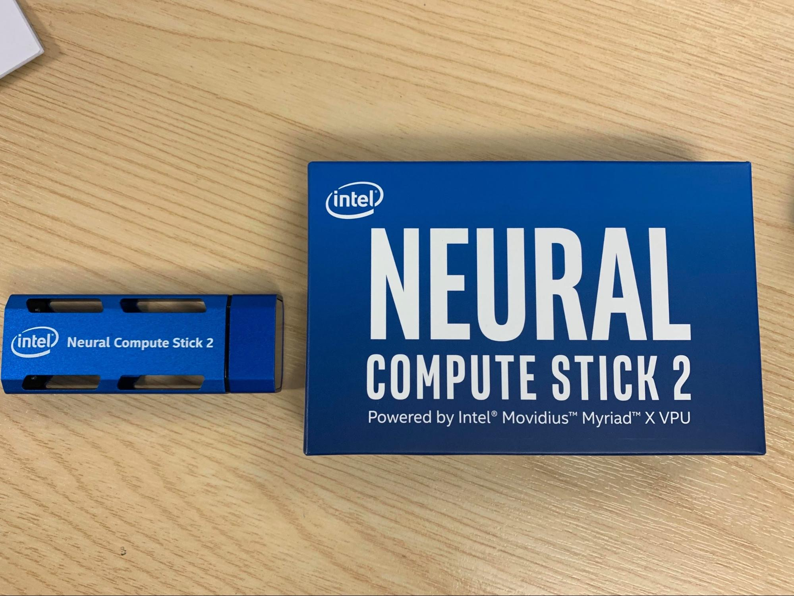
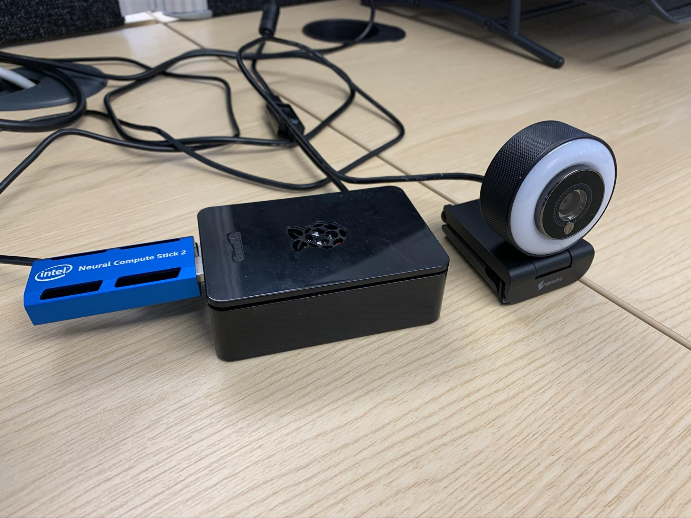
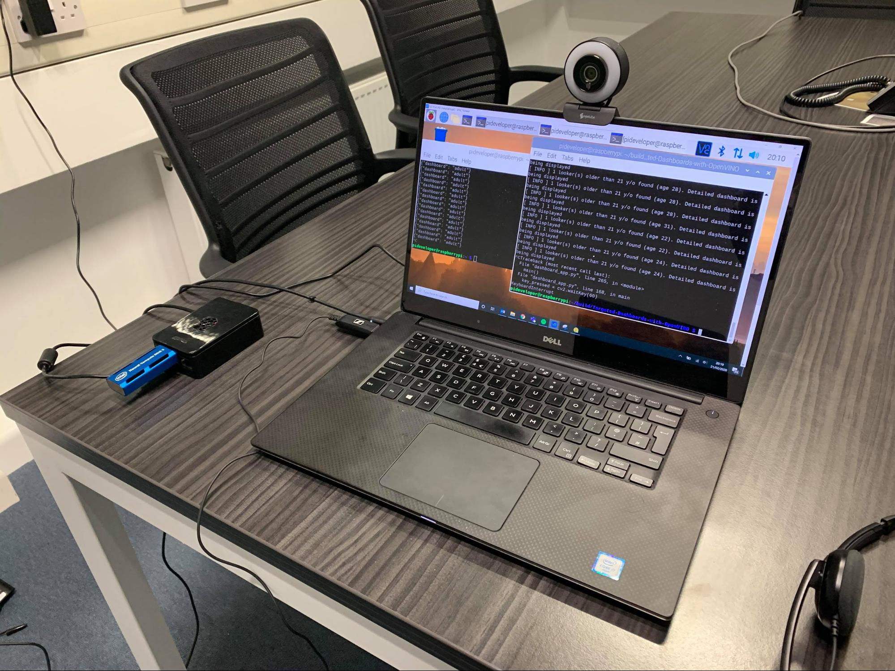
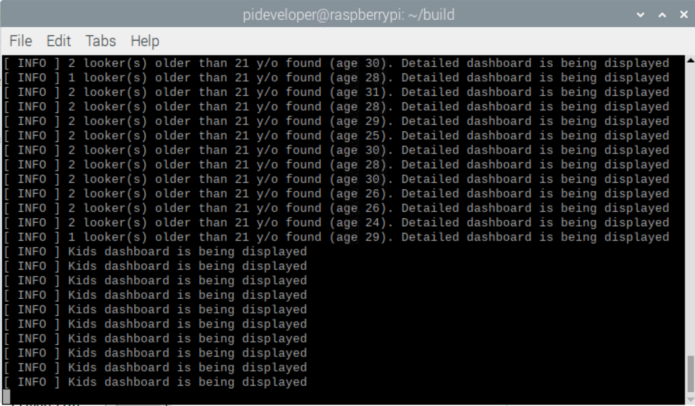
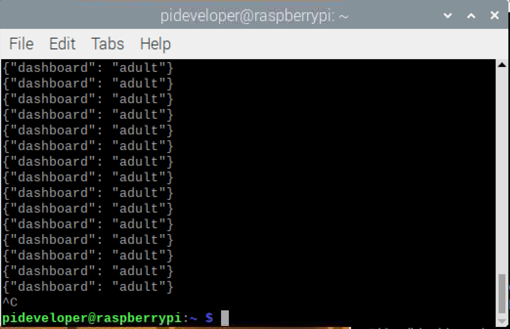

# Targeted-Dashboards-with-OpenVINO

Final Project for Intel edge scholarship with the aim of making energy efficiency fun through targeted dashboards.

## What it does

Information about the building coming sensors can be displayed in an unlimited number of forms through public dashboards. However, this information can be confusing for building users of certain ages, especially when the users are kids. No building user is irrelevant, thus we aim to include them in the energy efficiency journey through special dashboards that provide information targeted for children but at the same time, detailed information is available when adults are looking at them.

**Typical advanced dashboard**


**Kids-friendly dashboard**


**Neural compute stick**


**Neural compute stick connected the Raspberry Pi**



**Demo Setup**


**The application dashboard output**


**The MQTT client window output**



## Requirements
### Hardware

* Neural Compute Stick II, a Raspberry Pi 4, a High
Definition webcam. The Neural Compute Stick II provides the extra processing power required to
execute deep learning applications in small devices.

### Software
  
* Intel® Distribution of OpenVINO™ toolkit 2019 R3 Release.

## How It works

The application uses the Inference Engine included in the Intel Distribution of OpenVINO toolkit and the Intel Deep Learning Deployment Toolkit. we assume that a camera will be installed on top of a monitor that displays dashboards. The camera is used to grab frames and then uses three different Deep Neural Networks (DNNs) to process the data. Then, we deployed a script that uses three deep learning models that (1) detects faces
on a video stream coming from the camera, (2) estimates the age of the detected faces, (3) if any of the detected faces is older than 21 y/o, then a head pose estimation model determines whether the person is looking at the dashboard. When it is detected that a adult person is looking toward the screen, the dashboard will be switched from a children friendly to a more advanced dashboard that contains technical information. If an adult is no longer looking at the dashboard, it will change eventually to the kids’ version again.

This data are sent to a local web server using the Paho* MQTT C client libraries.

### Get the code

Clone the reference implementation:
```
sudo apt-get update && sudo apt-get install git
git clone https://github.com/nesreensada/Targeted-Dashboards-with-OpenVINO.git
``` 

### Install Intel® Distribution of OpenVINO™ toolkit

Refer to https://software.intel.com/en-us/articles/OpenVINO-Install-Linux for more information about how to install and setup the Intel® Distribution of OpenVINO™ toolkit.

You will need the OpenCL™ Runtime package if you plan to run inference on the GPU. It is not mandatory for CPU inference. 

### Other dependencies

#### Mosquitto*
Mosquitto is an open source message broker that implements the MQTT protocol. The MQTT protocol provides a lightweight method of carrying out messaging using a publish/subscribe model.

### Which model to use

This application uses the [face-detection-retail-0004](https://docs.openvinotoolkit.org/latest/_models_intel_face_detection_retail_0004_description_face_detection_retail_0004.html),
[age-gender-recognition-retail-0013](http://docs.openvinotoolkit.org/latest/_models_intel_age_gender_recognition_retail_0013_description_age_gender_recognition_retail_0013.html), 
 and [head-pose-estimation-adas-0001](https://docs.openvinotoolkit.org/2019_R3/_models_intel_human_pose_estimation_0001_description_human_pose_estimation_0001.html) Intel® model, that can be downloaded using the **model downloader**. The **model downloader** downloads the __.xml__ and __.bin__ files that is used by the application. 

To install the dependencies of the RI and to download the models Intel® model, run the following command:
```
    cd <path_to_the_Targeted-Dashboards-with-OpenVINO_directory>
    ./setup.sh 
```    
The models will be downloaded inside the following directories:
```
    /opt/intel/openvino/deployment_tools/open_model_zoo/tools/downloader/intel/face-detection-retail-0004/     
    /opt/intel/openvino/deployment_tools/open_model_zoo/tools/downloader/intel/age-gender-recognition-retail-0013/ 
    /opt/intel/openvino/deployment_tools/open_model_zoo/tools/downloader/intel/head-pose-estimation-adas-0001/ 
```

### The Config File

The _resources/config.json_ contains the path to the videos that will be used by the application.
The _config.json_ file is of the form name/value pair, `video: <path/to/video>`   

Example of the _config.json_ file:

```
{

    "inputs": [
	    {
            "video": "videos/video1.mp4"
        }
    ]
}
```

### Using the Camera instead of video

Replace the path/to/video in the _resources/config.json_  file with the camera ID, where the ID is taken from the video device (the number X in /dev/videoX).   

For example:

```
{

    "inputs": [
	    {
            "video": "0"
        }
    ]
}
```

## Setup the environment

### Running on the CPU

When running Intel® Distribution of OpenVINO™ toolkit Python applications on the CPU, the CPU extension library is required. This can be found at 

    /opt/intel/openvino/deployment_tools/inference_engine/lib/intel64/

Though by default the application runs on CPU, this can also be explicitly specified by ```-d CPU``` command-line argument:

```
	python3.7 dashboard_app.py -fm models/face-detection-retail-0004/FP16/face-detection-retail-0004.xml -pm models/head-pose-estimation-adas-0001/FP16/head-pose-estimation-adas-0001.xml -ag_m models/age-gender-recognition-retail-0013/FP16/age-gender-recognition-retail-0013.xml -d CPU
```


### Running on the Intel® Neural Compute Stick

To execute the project, first ensure that you have installed all the required dependencies for Raspberry Pi 4 and Neural Compute Stick II by following instructions from this [post](https://docs.openvinotoolkit.org/latest/_docs_install_guides_installing_openvino_raspbian.html)

To run on the Intel® Neural Compute Stick, use the ```-d MYRIAD``` command-line argument:
```
    python3.7 dashboard_app.py -fm models/face-detection-retail-0004/FP16/face-
detection-retail-0004.xml -pm models/head-pose-estimation-adas-
0001/FP16/head-pose-estimation-adas-0001.xml -ag_m models/age-gender-
recognition-retail-0013/FP16/age-gender-recognition-retail-0013.xml -d
MYRIAD
```

**Note:** The Intel® Neural Compute Stick can only run FP16 models. The model that is passed to the application, through the `-m <path_to_model>` command-line argument, must be of data type FP16.

### Machine to machine messaging with MQTT for raspberry pi

The setup using the following [post](https://appcodelabs.com/introduction-to-iot-build-an-mqtt-server-using-raspberry-pi):
then using the following command

```
mosquitto_sub -h localhost -t "test/message"
```

### Docker*
The current docker file is installed with ubuntu:16.04, OpenVino development kit, models and libararies

0. install docker
Use the following [instructions](https://docs.docker.com/install/)

1. build a docker images

```
cd <path_to_the_Targeted-Dashboards-with-OpenVINO_directory>/docker 
docker build --rm --build-arg proxy=$http_proxy --rm --tag openvino:v1 .
```

2. To Run docker images

```
docker run -v /etc/localtime:/etc/localtime:ro --rm -it -e http_proxy -e https_proxy -e ftp_proxy -v `pwd`:/work openvino:v1 bash
```

To mount the camera and access camera from docker env**
```
docker run -v /etc/localtime:/etc/localtime:ro --rm -it --device /dev/video0 -e http_proxy -e https_proxy -e ftp_proxy -v `pwd`:/work openvino:v1 bash
```

## copy the required files from the repo to the docker file
1. create directories in docker for the following directory 
```
cd /opt/intel/
mkdir models
mkdir outputs
mkdir resources
``` 

2. install the missing libraries 
```
sudo apt-get update
sudo apt-get install python3-pip
sudo apt-get install mosquitto mosquitto-clients
sudo pip3 install numpy jupyter paho-mqtt
pip3 install opencv-python
``` 

3. locally, find the running container name using the tag. eg.06da66bf4bca
```
sudo docker container ls
```
4.  copy the files to the docker container
```
sudo docker cp handle_models.py 06da66bf4bca:/opt/intel/.
sudo docker cp dashboard_app.py 06da66bf4bca:/opt/intel/.
sudo docker cp inference.py 06da66bf4bca:/opt/intel/.
sudo docker cp resources/config.json 06da66bf4bca:/opt/intel/resources
sudo docker cp models/face-detection-retail-0004/. 06da66bf4bca:/opt/intel/models
sudo docker cp models/age-gender-recognition-retail-0013/. 06da66bf4bca:/opt/intel/models/age-gender-recognition-retail-0013
sudo docker cp models/head-pose-estimation-adas-0001 /. 06da66bf4bca:/opt/intel/models/head-pose-estimation-adas-0001 
 
```

5. run the app

```
cd /opt/intel 
python3.5 dashboard_app.py -fm models/face-detection-retail-0004/FP16/face-detection-retail-0004.xml -pm models/head-pose-estimation-adas-0001/FP16/head-pose-estimation-adas-0001.xml -ag_m models/age-gender-recognition-retail-0013/FP16/age-gender-recognition-retail-0013.xml -d CPU
```

## References
1. https://github.com/intel-iot-devkit/shopper-gaze-monitor-python
2. https://github.com/nullbyte91/Intel-edge-AI-foundation-udacity
3. https://docs.openvinotoolkit.org/latest/_docs_install_guides_installing_openvino_raspbian.html
4. https://appcodelabs.com/introduction-to-iot-build-an-mqtt-server-using-raspberry-pi
